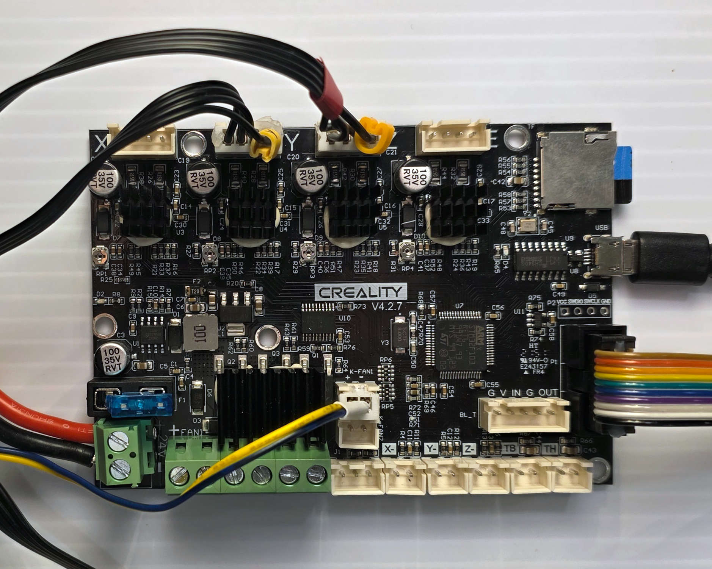

# 3D printed Super 8 Film Scanner (Pi 5 / Ender 3 Fork)

> **NOTE:** This is a forked version of the excellent repo provided by Stuart Pittaway at [stuartpittaway/Super8FilmScanner](https://github.com/stuartpittaway/Super8FilmScanner). 
>
> I initially planned to make a few minor changes and update his repo via a pull request, but I've completely rewritten much of the code and I'm not sure that is possible now. In addition, many of the changes were made quickly with LLM coding tools and the code needs additional testing. 

**Substantial changes in this fork:**
1.  **Raspberry Pi 5 Support:** Updated to run on [Raspberry Pi 5](https://www.raspberrypi.com/products/raspberry-pi-5/) using the latest Pi OS (Bookworm/Trixie). The code now supports `picamera2` rather than relying on the deprecated `picamera`.
2.  **Machine Learning Alignment:** Improved sprocket alignment using a custom-trained [YOLO](https://docs.ultralytics.com/) machine learning model for object detection. (Moved to a separate repo).
3.  **Ender 3 Hardware:** Documented how an old [Ender 3](https://www.creality.com/products/ender-3-3d-printer) can be used to provide most of the moving parts. My build was created using an Ender 3 Pro with an updated [Silent Board](https://www.creality3dofficial.com/products/creality-silent-mainboard-v4-2-7). If you don't have one handy, a cheap secondhand model provides the motherboard, stepper motors, a control panel (not needed, but useable here), and some T-slotted rail to use on other projects.

---

# Project Overview

The code and scanner were created quickly to achieve the job of scanning a handful of Super 8 reels at an acceptable quality. The code is unlikely to run straight out of the box on your computer/system; it will need minor amendments to folder names/paths etc.

## Items needed for this project
* [Raspberry Pi 4](https://www.raspberrypi.com/products/raspberry-pi-4-model-b/) or [Raspberry Pi 5](https://www.raspberrypi.com/products/raspberry-pi-5/)
* [Pi Advanced 12megapixel Camera](https://www.raspberrypi.com/products/raspberry-pi-high-quality-camera/)
* [Microscope lens for the Raspberry Pi High Quality Camera - 0.12-1.8x](https://shop.pimoroni.com/products/microscope-lens-0-12-1-8x)
* 3D printed frame (files in this repository). The FreeCAD files are from the original project. STL files have neem added for convenience. A simple manual film rewinder is also included, but to complete the build you'll need to mount it on some T-slot rail and add some V-slot roller wheels for bearings. Both of these can can be pulled from an Ender 3.
* Two small depth stepper motors (NEMA 17 style - can be pulled from an old Ender 3)
* RAMPS style motherboard for controlling the stepper motors and running [MARLIN](https://github.com/MarlinFirmware/Marlin) (can be pulled from an old Ender 3)
* Two stepper drivers (e.g., A4988) - **Not required** if using an Ender 3 motherboard, as the drivers are soldered onto the board.
* ~5000K "cool white" MR16 style LED light bulb (5 Watt). A [base socket](https://www.amazon.com/dp/B073FFBSJM) is also helpful. I used a 12V version and needed a [buck converter](https://www.amazon.com/dp/B076H3XHXP) to step the voltage down from the 24V Ender 3 power supply.
* A small spring. One from [this assortment](https://www.amazon.com/dp/B0F9PZ5QHL) will work.
* A rubber gasket to fit over the stepper motor gear to make contact with the film. One of these [rubber grommets](https://www.amazon.com/dp/B07YXXYY7R) worked, but wasn't perfect and needed modification.
* 24V Power supply (an old Ender 3 PSU will do)
* MicroSD card
* Various M3 screws (like [these](https://www.amazon.com/dp/B07VRC5RJ8)).

# YouTube Video (Original Project)

See Stuart Pittaway's video on how to use and build the *original* device. 
**Note:** The physical build in this fork differs (using Ender 3 parts), but the general concept remains the same.

https://youtu.be/rd1Xu6e6nrw

# Setup

This is a rough setup description and some steps might be missing, but here is what's necessary:

## Step 1 - Flash Marlin to the mainboard
If needed, flash your mainboard with the Marlin Firmware. You can find the latest release [here](https://marlinfw.org/meta/download/). Open Arduino IDE, make the required changes (for your mainboard), connect the Mainboard via USB and upload the firmware.

**Note:** If your motherboard was pulled from an Ender 3, this step is likely unnecessary as it should already be running Marlin.

## Step 2 - Install the Raspberry Pi OS on the Raspberry Pi
Install the Raspberry Pi Imager, which you can find [here](https://www.raspberrypi.com/software/).

Plug the microSD card into your computer and choose to install the **Raspberry Pi OS (64-bit)** (Bookworm or later) in the imager software. Click the gear icon to open the advanced settings. Choose a hostname (e.g., "scanner"), add a username/password, activate SSH under "services", and add your Wifi settings.

## Step 3 - Wiring
Assemble the scanner according to the 3D files.




1.  Plug the stepper drivers into the mainboard's Y and Z axis (if not integrated), then plug in the stepper motors. 
2.  Consider adding a heatsink to the Y-axis stepper driver, as it is used the most. 
    *   *Tip:* If the Y-Axis stepper from the Ender 3 runs in the wrong direction, you may need to reverse the plug orientation or configure this in Marlin.
3.  Slot the Raspberry Pi HQ camera ribbon cable into the Raspberry Pi and lock it in place.
4.  Plug the LED wires into the fan header.
5.  Connect the power supply to the mainboard via the two cables. **Ensure the power supply is disconnected from the wall while wiring.**
6.  *(Optional)* Connect the Ender 3 control panel. This is not needed but may help with troubleshooting.(See the rainbow colored cable to the right above.)
7.  Connect the mainboard to the Raspberry Pi via USB.

## Step 4 - Connecting to the Raspberry Pi
If you don't plan to use the scanner with a dedicated monitor, keyboard, and mouse, you must connect via Terminal and VNC.

1.  Turn on the Raspberry Pi and the PSU.
2.  Use SSH to connect to `<username>@scanner.local`.
3.  Enable VNC on the Pi:
    1. Run the command: `sudo raspi-config`
    2. Navigate to `Interface Options` (option 5).
    3. Select `VNC` (option P3).
    4. Choose `Yes` to enable VNC.
    5. Exit raspi-config. RealVNC Server will start automatically on boot.
4. Download and install a VNC client on the computer you will connect to your Raspberry Pi. (e.g. [RealVNC Viewer](https://www.realvnc.com/en/connect/download/viewer/))

## Step 5 - Install dependencies
The software relies on `picamera2`, `pyserial`, and `opencv`. The first two should be available in the default system build, so start by installing OpenCV:

```bash
sudo apt update
sudo apt upgrade
sudo apt install python3-opencv
```

If you are running an older version of the Raspberry Pi OS and need the additional libraries, install them:
```bash
sudo apt install python3-picamera2 python3-serial
```

The following is not required, but you might find the [Visual Studio Code](https://code.visualstudio.com/) IDE helpful:
```bash
sudo apt install code
```

# Scanning Process

## Step 1 - Capture full frame masters

On the Raspberry Pi, use the python code in `RasPi_Camera_Super8Scanner.py` to capture individual frames to PNG files.

**Configuration:**
The scanner settings (frame dimensions, feed rates, exposure defaults) are located in the `ScannerConfig` class at the top of `RasPi_Camera_Super8Scanner.py`. Edit these values to match your specific hardware setup.

**Running the Scanner:**
```bash
python3 RasPi_Camera_Super8Scanner.py
```

**Controls:**
- **Startup Alignment:** Use the arrow keys to align the film. Press `SPACE` to start scanning.
- **Scanning:** The scanner will automatically advance frames.
- **Manual Mode:** Press `m` to enter manual mode if things go wrong.
    - `f`/`b`: Forward/Backward nudge
    - `[`/`]`: Adjust threshold. Hold Shift to advance 10 steps at a time.
    - `SPACE`: Resume auto-scanning

This will generate a large number of files (3000+) of significant file size 2+MByte each.  Camera captures approximately 3megapixel images.

The images captured will look like this (only higher resolution). Notice you can see the sprocket hole and the black border on the right of the image.


## Step 2 - Alignment
The alignment process is computationally intensive and runs much faster on a dedicated machine, particularly one with a dedicated GPU and NVMe drive. The code for doing this, which was once part of this repo, has been completely refactored and split off into a separate repo. 

**[Link TBD]**

## Configuration
Advanced settings can be found in the `ScannerConfig` class within `RasPi_Camera_Super8Scanner.py`. Key settings include:

| Setting | Description | Default |
| :--- | :--- | :--- |
| `CAMERA_EXPOSURE` | List of EV values. Add multiple (e.g., `[-2.0, 0.0, 2.0]`) for HDR bracketing. | `[-8.0]` |
| `FRAME_SPACING` | Millimeters of film to advance per frame. Tweak this if you find your scanning process moving back and forth frequently to correct frame drift. This can slow down the scan significantly. | `16.0` |
| `NUDGE_FEED_RATE` | Speed of the motor during manual adjustments. | `1000` |

## Output Directory Structure
Images are saved to the `Capture` folder in the current directory.
*   `./Capture/Capture-8.0/`: Contains the raw PNG images for the -8.0 EV exposure.
*   If you configure multiple exposures, additional folders (e.g., `Capture-2.0`) will be created.

## Code Overview
*   `RasPi_Camera_Super8Scanner.py`: Main application loop, state management, and UI.
*   `camera_control.py`: Wrapper for `picamera2` handling hardware interactions.
*   `marlin_control.py`: Handles G-code serial communication with the stepper board.
*   `image_processing.py`: OpenCV logic for sprocket detection and image analysis.

## 3D Print Files
The `3d-Print-Files` folder contains FreeCAD (`.FCStd`) source files. You will need [FreeCAD](https://www.freecad.org/) to view these or export them as STL files for printing.

## Troubleshooting
*   **Serial Permission Error:** If you get a permission error accessing `/dev/ttyUSB0`, run `sudo usermod -a -G dialout $USER` and reboot.
*   **Camera Errors:** Ensure the camera works outside the script by running `libcamera-hello` in a terminal.
*   **Sprocket Detection Fails:** If the scanner keeps stopping, try adjusting the backlight brightness or use the `[` and `]` keys during the scan to adjust the detection threshold.
*   **Constant Adjustments During Scan:** The scanning process should continue advancing the film with minimal adjustment. If you notice it frequently pausing for micro-adjustments, adjust the `FRAME_SPACING` setting to better work with your setup.

## License
This project is licensed under the GNU General Public License v3.0. See the `LICENSE` file for details.